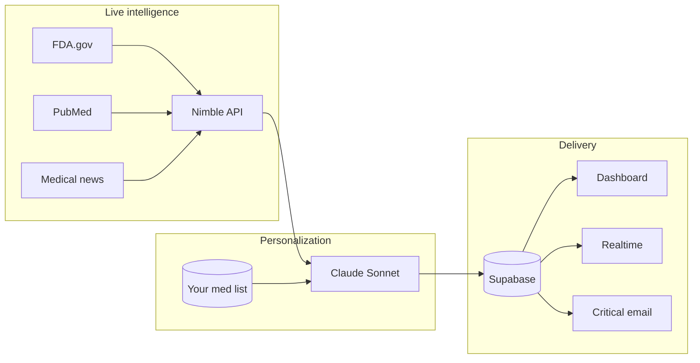

<div align="center">

# MediGuard AI

### Real-time medication safety intelligence — personalized to your prescriptions

**DeveloperWeek New York 2026** · Nimble Challenge + Overall track

[](https://www.developerweek.com/)
[](https://www.nimbleway.com/)
[](https://www.anthropic.com/)
[]()

*Not a doctor. Not a diagnosis tool. A patient-facing safety layer between public FDA data and the people who need it.*

[Problem](#-the-problem) · [Solution](#-the-solution) · [How it works](#-how-it-works) · [Demo](#-demo-flow) · [Tech](#-tech-stack) · [Start](#-quick-start)

</div>

---

## The problem

Every year, **1.5 million Americans** are harmed by medication errors. The FDA publishes **100,000+** drug safety signals — but patients receive **zero** proactive, personalized alerts. **35%** of clinicians ignore routine safety alerts (alert fatigue). **125,000** deaths annually are linked to adverse drug events.

> The information exists. It never reaches the right person at the right time.

**Who hurts most:** elderly patients on multiple prescriptions, chronic-care households, and **53 million** unpaid caregivers managing medications without clinical tooling.

---

## The solution

**MediGuard AI** is a personal medication safety intelligence agent.

| Step | What happens |
|------|----------------|
| **1. Profile** | Add your medications once (brand + generic). |
| **2. Intelligence** | **Nimble** crawls FDA communications, PubMed, DailyMed, and medical news in real time. |
| **3. Personalization** | **Claude** matches findings to *your* list, scores severity, explains in plain language, links primary sources. |

**Signal over noise** — not a MedWatch blast of 100,000 alerts; only what applies to *you*.

| Legacy | MediGuard |
|--------|-----------|
| Static drug DB (stale) | **Live web** via Nimble |
| All FDA alerts → everyone | **AI-filtered** to your meds |
| Provider-only CDS | **Patient + caregiver** facing |
| Jargon | **Plain language** + source URLs |

---

## How it works



- **Scan Now** or scheduled cron (every 6h) → Nimble extract / search / crawl → Claude JSON alerts → dedupe → Supabase → Realtime UI + Resend for critical items.
- Alerts below **0.75** confidence are suppressed — tuned to reduce false alarms.

---

## Demo flow

| # | Experience |
|---|------------|
| 1 | Sign up → add sample meds (e.g. Metformin, Lisinopril, Warfarin) |
| 2 | **Scan Now** — live FDA / news pull via Nimble |
| 3 | Critical alert on dashboard (Supabase Realtime) |
| 4 | Detail view: summary, action, **FDA source link** |
| 5 | **Ask MediGuard** — chat with Nimble tool + streamed Claude reply |
| 6 | Caregiver read-only link — family sees the same alert |

---

## Why it matters

| Lens | Value |
|------|--------|
| **Impact** | Prevents silent harm from information patients never receive |
| **Innovation** | Nimble + Claude = real-time personalization, not a static checker |
| **Market** | 131M Americans on prescriptions; caregiver + B2B paths |
| **Sponsor fit** | Nimble Search, Extract, and Crawl are the core intelligence layer |

---

## Tech stack

| Layer | Technology |
|-------|------------|
| Application | Next.js 14, TypeScript, Tailwind, shadcn/ui |
| Data & auth | Supabase (PostgreSQL, RLS, Realtime) |
| Web intelligence | **Nimble API** |
| AI | **Anthropic Claude** (Sonnet, caching, tool use) |
| Email | Resend |
| Hosting | Vercel + Cron |

---

## Quick start

```bash
git clone https://github.com/adindamochamad/mediaguard-ai.git
cd mediaguard-ai
npm install

cp .env.example .env.local
# ANTHROPIC_API_KEY, NIMBLE_USERNAME, NIMBLE_PASSWORD,
# NEXT_PUBLIC_SUPABASE_*, SUPABASE_SERVICE_ROLE_KEY, RESEND_API_KEY

npm run dev
```

```bash
npm run setup:git-hooks   # blocks .env & internal strategy files from commits
```

---

## Hackathon

| | |
|--|--|
| **Event** | DeveloperWeek New York 2026 |
| **Deadline** | June 10, 2026 |
| **Tracks** | Overall + Nimble Challenge |
| **Live demo** | *(add Vercel URL when deployed)* |

---

## Disclaimer

MediGuard aggregates **public** safety information in consumer-friendly language. It is **not** medical advice, diagnosis, or treatment. Always consult your physician or pharmacist before changing medications.

---

## Team

**Adinda Panca Mochamad**

---

<div align="center">

**MediGuard AI** — *The one alert that matters to you.*

</div>
