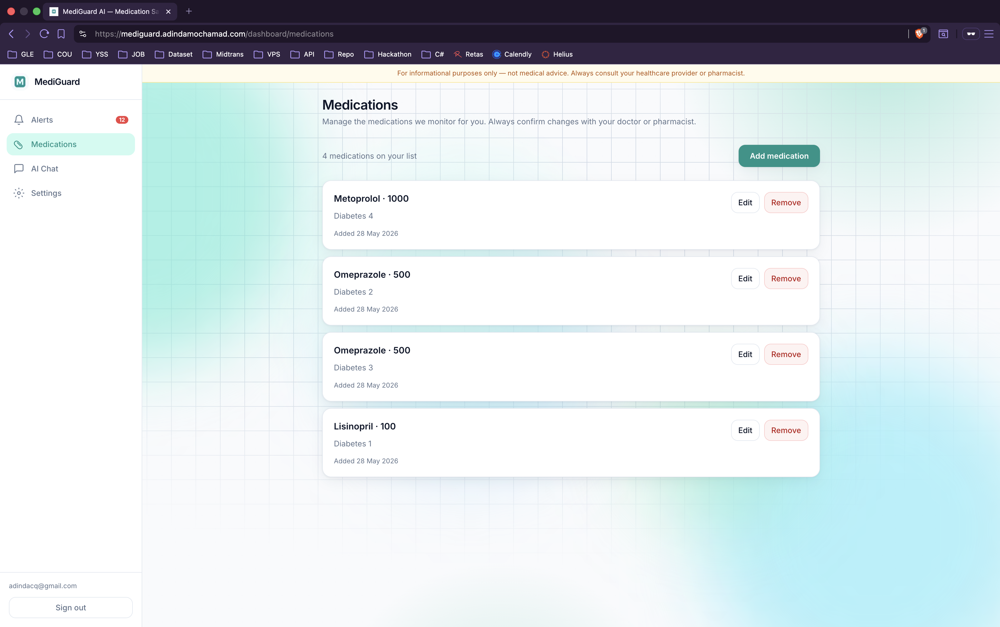
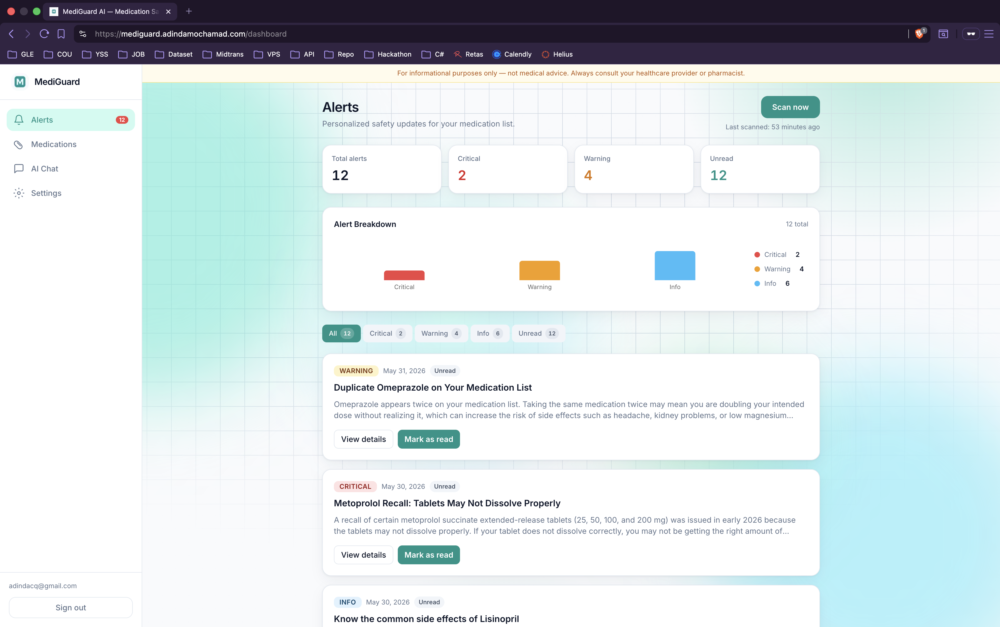
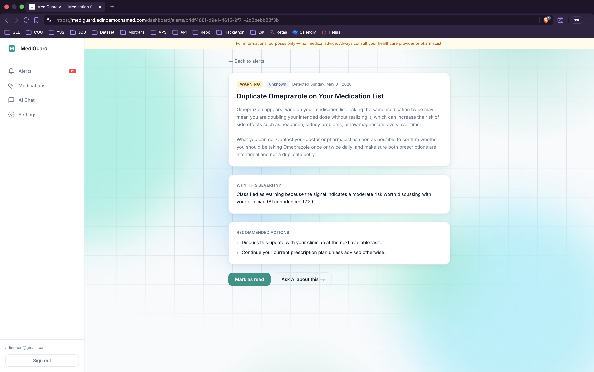
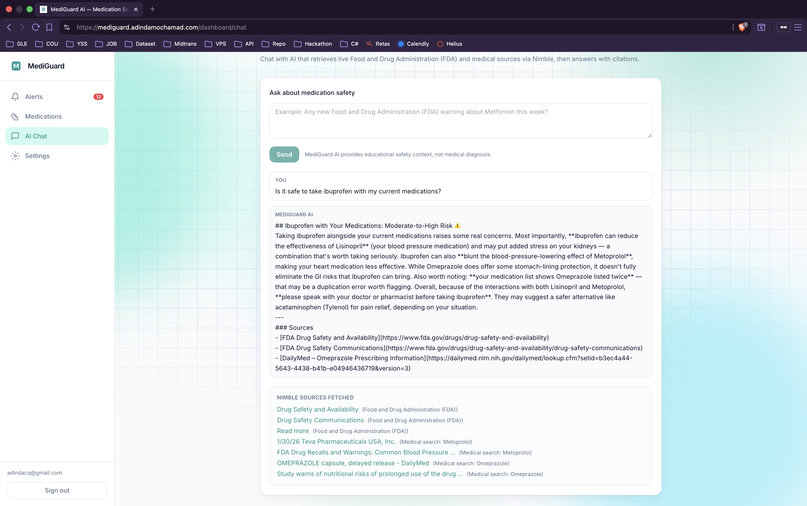
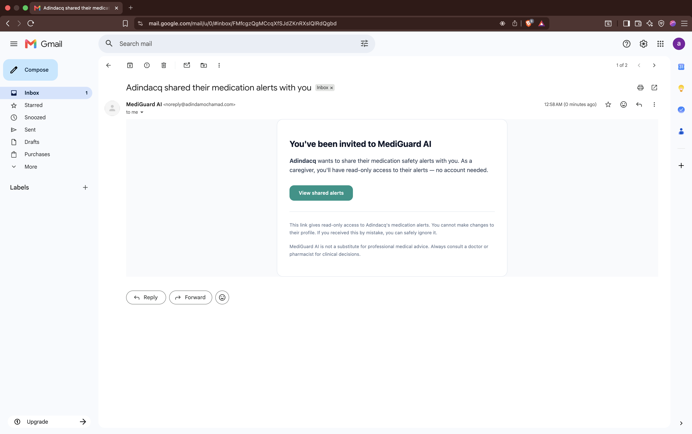
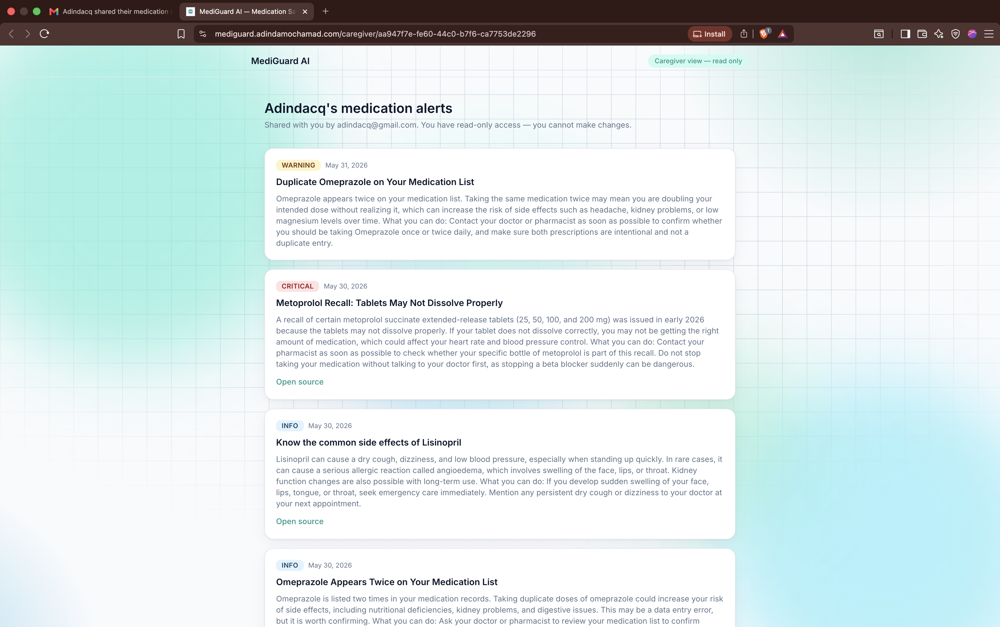
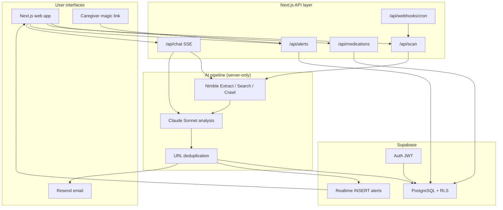
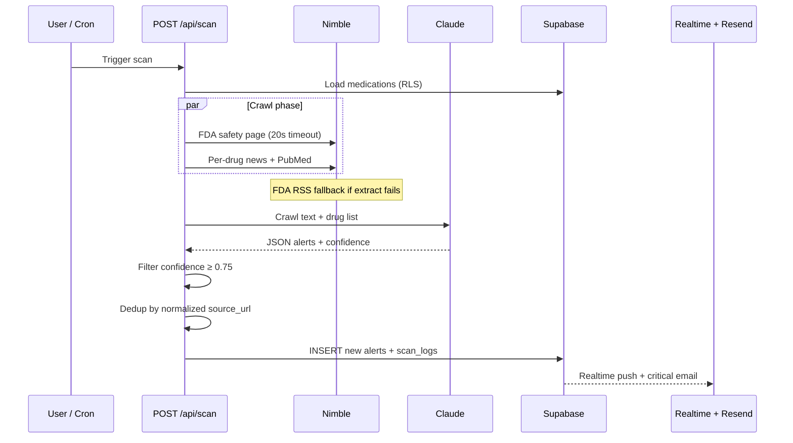

<div align="center">

# MediGuard AI

### Real-time medication safety intelligence — personalized to your prescriptions

**DeveloperWeek New York 2026** · Nimble Challenge + Overall track

[](https://www.nimbleway.com/)
[](https://www.anthropic.com/)
[](https://nextjs.org/)
[](https://supabase.com/)

*Not a diagnosis tool. A patient-facing safety layer between public Food and Drug Administration (FDA) data and the people who need it.*

[Problem](#-the-problem) · [Solution](#-the-solution) · [Screenshots](#-screenshots) · [Architecture](#-architecture) · [How it works](#-how-it-works-deep-dive-for-judges) · [Features](#-features) · [Quick start](#-quick-start) · [Demo](#-demo-script-60-seconds) · [Limitations](#-known-limitations)

</div>

---

## The problem

Every year, **1.5 million Americans** are harmed by medication errors. The Food and Drug Administration (FDA) publishes **100,000+** drug safety signals annually — but patients receive **zero** proactive, personalized alerts.

- **35%** of clinicians ignore routine safety alerts (alert fatigue from irrelevant noise)
- **125,000** deaths annually linked to adverse drug events
- **53 million** unpaid caregivers manage prescriptions with no safety tooling

> The information exists. It never reaches the right person at the right time.

---

## The solution

MediGuard AI is a personal medication safety intelligence agent. Add your medications once — MediGuard monitors Food and Drug Administration (FDA) communications, PubMed studies, and medical news in real time, then delivers only the alerts that are relevant to *your* specific list, in plain language, with links directly to the source.

| Legacy tools | MediGuard AI |
|---|---|
| Static drug database (months stale) | **Live web** via Nimble crawl |
| All Food and Drug Administration (FDA) alerts → everyone | **AI-filtered** to your medication list |
| Provider-only clinical decision support | **Patient + caregiver** facing |
| Medical jargon | **Plain language** + verifiable source URLs |

---

## Screenshots

Product flow in five screens (plus email + caregiver). Full-resolution files: [`public/screenshots/`](public/screenshots/).

### Landing & onboarding

<p align="center">
  
</p>

*Hero, value proposition, and entry to sign up — consumer health-tech tone, not clinical alarmism.*

### Medication profile

<p align="center">
  
</p>

*Users add brand name, generic, dosage, and notes. Free-text names are allowed (no proprietary drug DB required).*

### Alerts dashboard (Scan Now + Realtime)

<p align="center">
  
</p>

*Severity-coded cards, KPI row, filter tabs, and **Scan Now** — new alerts can appear live via Supabase Realtime.*

### Alert detail & source traceability

<p align="center">
  
</p>

*Every meaningful alert ties back to a primary URL (FDA, PubMed, etc.) — the architectural requirement for trustworthy consumer safety.*

### AI Chat (Nimble + Claude SSE)

<p align="center">
  
</p>

*Streaming answers with a **Nimble sources fetched** panel — judges can verify live web intel, not a static FAQ.*

### Critical email & caregiver (optional MVP paths)

<table>
<tr>
<td width="50%" align="center">
<strong>Critical alert email</strong><br/><br/>

</td>
<td width="50%" align="center">
<strong>Caregiver read-only view</strong><br/><br/>

</td>
</tr>
</table>

---

## Architecture

High-level system: Next.js app + API routes, Supabase for auth/data/realtime, Nimble for live crawl/search, Claude for relevance and plain-language summaries, Resend for critical email.



### Alert pipeline (sequence)



### Repository map (where judges should look)

| Path | Role |
|------|------|
| `lib/scan/jalankan-scan-untuk-pengguna.ts` | End-to-end scan: Nimble → Claude → dedup → DB |
| `lib/nimble.ts` | FDA crawl + RSS fallback, news search, PubMed |
| `lib/claude/analyze-for-alerts.ts` | Structured alert JSON from crawl |
| `lib/scan/deduplikasi-alert.ts` | Same URL → no spam |
| `app/api/chat/route.ts` | SSE chat + Nimble source prefetch |
| `app/api/webhooks/cron/route.ts` | Batch scan every 6h (`Bearer CRON_SECRET`) |
| `supabase/migrations/001_schema_rls.sql` | Tables + row-level security |

Extended architecture notes (data models, chat flow, security table): [`ARCHITECTURE.md`](ARCHITECTURE.md).

---

## How it works (deep dive for judges)

This section is the technical narrative behind the demo — what runs, what fails gracefully, and why the design is defensible for a **Nimble + Claude** hackathon entry.

### 1. Triggers — when does a scan run?

| Trigger | Entry point | Auth |
|---------|-------------|------|
| **Scan Now** | `POST /api/scan` | Supabase session cookie |
| **Cron (every 6h)** | `GET /api/webhooks/cron` | `Authorization: Bearer $CRON_SECRET` |
| **Demo fallback** | Same `POST /api/scan` when `DEMO_FALLBACK=true` | Inserts cached alerts — no Nimble/Claude |

Cron loads every `user_id` that has at least one row in `medications`, then runs the same pipeline as manual scan per user (service role client).

### 2. Nimble crawl phase — live web, not a static DB

For each scan, the server (`lib/scan/jalankan-scan-untuk-pengguna.ts`):

1. Loads the user’s medications from Supabase (max **9** drugs per crawl batch).
2. Calls **Nimble** in parallel with a **20s timeout** per request:
   - `crawlFDAAlerts()` — FDA Drug Safety Communications page
   - Per medication: `searchMedicalNews()` + `crawlPubMed()`
3. **Failure handling:** If FDA extract times out or errors, that branch is skipped; if the HTML parse is empty, **`crawlFDAAlerts` falls back to the public FDA RSS feed** (`lib/nimble.ts`). Per-drug timeouts are swallowed so other drugs still contribute content.
4. Merges all text into one crawl bundle via `siapkan_konten_crawl_untuk_analisis()` for Claude.

If **no** crawl text remains after fallbacks, the API returns **502** with a clear message (`Tidak ada konten crawl…`) — no silent empty success.

### 3. Claude analysis — relevance, severity, confidence

- Model: **Claude Sonnet** (`lib/claude/konstanta.ts`).
- Prompt instructs: match only the patient’s drug list, assign `critical` / `warning` / `info`, return JSON with `confidence` 0–1.
- Server-side filter (`lib/validasi-alert.ts`): drops alerts with `confidence < 0.75` (`ambang_keyakinan_minimum` in `lib/konstanta.ts`), non-relevant drugs, or invalid schema (Zod).

This is the **signal-over-noise** product decision: better to show nothing than a wrong alarm.

### 4. Deduplication — no duplicate URLs

Before insert, each candidate alert is checked against existing rows for that user (`lib/scan/deduplikasi-alert.ts`):

- Normalize `source_url` (trim, lowercase host/path rules).
- Skip if the same user + medication + URL already exists.
- Second **Scan Now** increments `jumlah_alert_duplikat` in the JSON response instead of flooding the UI.

### 5. Persistence & delivery

| Step | What happens |
|------|----------------|
| Insert | `alerts` row: title, summary, severity, `source_url`, `ai_confidence`, `medication_id` |
| Log | `scan_logs`: `sources_crawled`, `alerts_generated`, `duration_ms` |
| Realtime | Supabase publication on `alerts` → dashboard updates without full page reload |
| Email | If `severity === 'critical'`, Resend sends `CriticalAlertEmail` (Hari 9) |

### 6. AI Chat — separate path, same Nimble truth

`POST /api/chat` is **not** the scan pipeline:

1. Loads the user’s medication names from DB.
2. Prefetches Nimble sources (FDA slice + per-drug medical search) server-side.
3. Builds a single prompt with **“Live source shortlist from Nimble”** and streams tokens via **SSE** (`text/event-stream`).
4. First SSE event includes `meta.sumber[]` for the UI “Nimble sources fetched” panel.

Policy baked into the prompt: no diagnosis, no direct start/stop medication orders — consult clinician.

### 7. Security & privacy (demo scope)

| Concern | Implementation |
|---------|------------------|
| Data isolation | Supabase **RLS** — users only read/write their rows |
| API secrets | Nimble, Anthropic, Resend, `SERVICE_ROLE` — **server only**, never `NEXT_PUBLIC_*` |
| Cron abuse | `CRON_SECRET` required on webhook |
| PHI minimization | Email + medication names only; no diagnoses stored by design |

### 8. Automated verification

```bash
npm run test          # parsers, Zod alerts, dedup, timeout resiliensi
npm run test:polish   # E2E: signup → meds → scan → alerts → complex chat (needs dev on :3001)
curl http://localhost:3001/sitemap.xml
```

Manual checklist for judges reproducing in a browser: [`TESTING.md`](TESTING.md).

### 9. One-line pitch for the pipeline

> **Nimble** brings fresh FDA/PubMed/news text off the live web → **Claude** decides what matters for *your* pill list → **Supabase** stores, dedupes, and pushes only those rows to you (and email if critical).

---

## Features

| Feature | Description |
|---|---|
| **Medication profile** | Add/edit/delete medications with brand name, generic, dosage, and condition note |
| **Live scan** | On-demand Nimble crawl → Claude analysis → alert storage in one pipeline |
| **Alert dashboard** | Severity-coded cards (Critical / Warning / Info) with real-time Supabase push |
| **Filter + stats** | Filter by severity, unread count badge, KPI summary row, scan history |
| **Alert detail page** | Dedicated URL per alert — severity rationale, action items, source link |
| **AI Chat** | Ask questions about your medications; Claude answers with live Nimble sources and streaming response |
| **Email notifications** | Critical alerts trigger an immediate Resend email to the patient |
| **Caregiver sharing** | Invite a family member or doctor — they get a read-only magic link, no account needed |
| **Onboarding flow** | Step-by-step guidance for first-time users |
| **Scan fallback** | `DEMO_FALLBACK=true` bypasses Nimble for zero-risk live demos |
| **Sitemap** | `/sitemap.xml` for landing, login, signup (`app/sitemap.ts`) |

---

## Tech stack

| Layer | Technology |
|---|---|
| Framework | Next.js 14 (App Router), TypeScript |
| Styling | Tailwind CSS, Recharts, Sonner |
| Database + Auth | Supabase (PostgreSQL + Row Level Security + Realtime) |
| Web intelligence | **Nimble API** (Extract, Search, Crawl) |
| AI | **Anthropic Claude Sonnet** (prompt caching, tool use, SSE streaming) |
| Email | Resend + React Email |
| Hosting | VPS (PM2 + Nginx) or Vercel |
| Demo video | Remotion (`video/`) |

---

## Quick start

### Prerequisites

- Node.js 20+
- Supabase project ([free tier](https://supabase.com))
- Nimble API key ([nimbleway.com](https://www.nimbleway.com))
- Anthropic API key ([console.anthropic.com](https://console.anthropic.com))
- Resend API key ([resend.com](https://resend.com)) — for email notifications

### Setup

```bash
git clone https://github.com/adindamochamad/mediaguard-ai.git
cd mediaguard-ai
npm install
cp .env.example .env.local
```

Fill in `.env.local`:

```
ANTHROPIC_API_KEY=
NIMBLE_API_KEY=
NEXT_PUBLIC_SUPABASE_URL=
NEXT_PUBLIC_SUPABASE_ANON_KEY=
SUPABASE_SERVICE_ROLE_KEY=
RESEND_API_KEY=
NEXT_PUBLIC_APP_URL=http://localhost:3001
CRON_SECRET=your-random-secret
# Live demo on stage — set true to skip Nimble/Claude (cached alerts, ~1s Scan Now)
DEMO_FALLBACK=false
```

**Live demo tip:** If Nimble or Claude is slow or rate-limited during judging, set `DEMO_FALLBACK=true` in `.env.local` and restart `npm run dev`. Scan Now uses pre-built alerts from `lib/scan/demo-fallback.ts` (Supabase Realtime still fires). Use `DEMO_FALLBACK=false` when showing the full Nimble → Claude pipeline.

Run the database migrations in your Supabase SQL Editor:

```bash
# Run in order:
supabase/migrations/001_schema_rls.sql
supabase/migrations/002_realtime_alerts.sql
supabase/migrations/003_alert_feedback.sql
```

Start the dev server:

```bash
npm run dev
# → http://localhost:3001
```

Verify all services are connected:

```bash
curl http://localhost:3001/api/health/db
curl http://localhost:3001/api/health/nimble
curl http://localhost:3001/api/health/claude
curl http://localhost:3001/api/health/email
```

### Deploying to VPS

```bash
npm run build
pm2 start ecosystem.config.js --env production

# Background scan every 6 hours:
crontab -e
# add: 0 */6 * * * curl -s -H "Authorization: Bearer YOUR_CRON_SECRET" https://yourdomain.com/api/webhooks/cron
```

Configure Nginx to proxy port 3001 and terminate SSL (Let's Encrypt recommended). For AI Chat streaming, disable proxy buffering on the chat route.

---

## Demo script (~60 seconds)

| Step | Action | What to highlight |
|------|--------|-------------------|
| 0 | Set `DEMO_FALLBACK=true` in `.env.local` if APIs are slow | Instant Scan Now (~1s), writes `scan_logs`, dedupes repeat demos — say “production uses live crawl” |
| 1 | Sign up → add **Metformin** + **Lisinopril** | Personalization input |
| 2 | **Scan Now** | With fallback: cached alerts + Realtime; live: Nimble + Claude (15–120s) |
| 3 | Alert card appears | Realtime + severity badge |
| 4 | Open alert detail | FDA / PubMed **source URL** (fallback uses real FDA recall copy) |
| 5 | **AI Chat** — ask about interaction or recent FDA news | SSE stream + Nimble sources panel (needs live APIs) |
| 6 | (Optional) Caregiver invite | Magic link read-only view |
| 7 | **Scan history** (`/dashboard/history`) | Past scans: time, sources, alerts found, duration |

**When to use fallback:** stage Wi‑Fi, cold APIs, or scan timeouts over 2 minutes. **When to use live:** Nimble Challenge judging — run health checks first, then set `DEMO_FALLBACK=false`.

---

## Known limitations

These are intentional scope decisions for the hackathon MVP, not bugs.

1. **Drug name matching** — Free-text medication profile; no medical terminology NLP (e.g. “Tylenol” vs “acetaminophen” usually work via Claude context, but typos and obscure synonyms may be missed).
2. **FDA coverage** — Primarily FDA Drug Safety Communications (+ RSS fallback), not a full pharmacovigilance or adverse-event reporting database.
3. **No real-time monitoring** — Scans are manual (**Scan Now**) or cron-based (every 6 hours), not continuous background surveillance.
4. **Simplified severity** — `critical` / `warning` / `info` are AI-assigned and interpretive, not clinical-grade triage.
5. **English only** — UI and patient-facing copy are English (US consumer health context); codebase comments and some internal names use Indonesian per team convention.

---

## Disclaimer

MediGuard aggregates **public** safety information from FDA.gov (Food and Drug Administration), PubMed, and medical news in consumer-friendly language. It is **not** medical advice, diagnosis, or treatment. Always consult your physician or pharmacist before changing any medication.

---

<div align="center">

Built by **Adinda Panca Mochamad** for DeveloperWeek NYC 2026

*MediGuard AI — The one alert that matters to you.*

</div>
