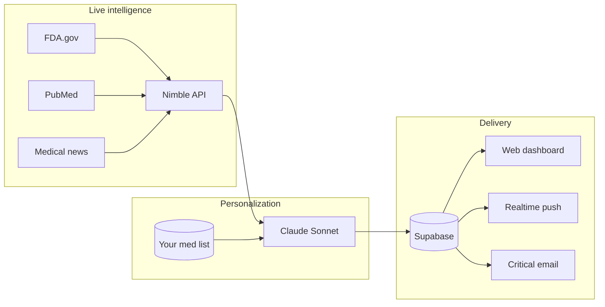

<div align="center">

# MediGuard AI

### Real-time medication safety intelligence — personalized to your prescriptions

**DeveloperWeek New York 2026** · Target: Overall Winner + **Nimble Challenge**

[](https://www.developerweek.com/)
[](https://www.nimbleway.com/)
[](https://www.anthropic.com/)
[]()

*Not a doctor. Not a diagnosis tool. A patient-facing safety layer between public FDA data and the people who need it.*

[Problem](#-the-problem) · [Solution](#-the-solution) · [How it works](#-how-it-works) · [Demo flow](#-demo-flow-judges) · [Tech](#-tech-stack) · [Docs](#-documentation) · [Team](#-team)

</div>

---

## The problem

Every year, **1.5 million Americans** are harmed by medication errors. The FDA publishes **100,000+** drug safety signals — but patients receive **zero** proactive, personalized alerts. Clinicians drown in noise: **35%** ignore routine safety alerts. **125,000** deaths annually are linked to adverse drug events.

> The information exists. It never reaches the right person at the right time.

**Who hurts most:** elderly patients on polypharmacy, chronic-care households, and **53 million** unpaid caregivers managing medications without clinical tooling.

---

## The solution

**MediGuard AI** is a personal medication safety intelligence agent.

1. **Profile** — Add your medication list once (brand + generic).
2. **Intelligence (Nimble)** — Live crawl of FDA safety communications, PubMed signals, DailyMed updates, and medical news.
3. **Personalization (Claude)** — Match crawled content to *your* list, score severity, explain in plain language, link primary sources.

**Signal over noise:** two users with different lists get different alerts from the same crawl — not a generic MedWatch blast.

| Legacy approach | MediGuard |
|-----------------|-----------|
| Static drug databases (months old) | **Live web** via Nimble |
| All FDA alerts → everyone | **AI-filtered** to your meds |
| Provider-only CDS (Epic alerts) | **Patient + caregiver** facing |
| Medical jargon | **Plain-language** actions + source URLs |

---

## How it works



**Pipeline:** scheduled scan (Vercel Cron, every 6h) or **Scan Now** → Nimble extract/search/crawl → Claude structured JSON alerts → dedupe → store → notify (Realtime + Resend for critical).

**Confidence policy:** alerts surface only above **0.75** relevance confidence — calibrated to *under-alert* rather than panic.

---

## Demo flow (judges)

| Step | What you see |
|------|----------------|
| 1 | Sign up → add Metformin, Lisinopril, Warfarin |
| 2 | **Scan Now** → Nimble hits FDA + news in real time |
| 3 | Critical alert appears on dashboard (Supabase Realtime) |
| 4 | Open alert → plain summary, action, **FDA source link** |
| 5 | **Ask MediGuard** chat → Claude calls Nimble tool → streamed, cited answer |
| 6 | Caregiver magic-link view — family sees the same alert without full signup |

Full script: [`docs/05-PITCH.md`](docs/05-PITCH.md) · MVP scope: [`docs/04-FEATURES.md`](docs/04-FEATURES.md)

---

## Why this wins

| Criterion | MediGuard fit |
|-----------|----------------|
| **Concept** | Undeniable crisis + emotional caregiver hook |
| **Progress** | End-to-end Nimble → Claude → DB → UI + live demo URL |
| **Feasibility** | B2C $9.99/mo + pharmacy/insurer API path — [`docs/08-BUSINESS_MODEL.md`](docs/08-BUSINESS_MODEL.md) |
| **Sponsor** | Nimble Search + Extract + Crawl are the **core moat**, not glue code |

Pattern match with recent healthcare / caregiver / real-time AI winners (Alzi, Caregiver, PhishShield-style live intel).

---

## Tech stack

| Layer | Choice |
|-------|--------|
| App | Next.js 14 (App Router), TypeScript, Tailwind, shadcn/ui |
| Data + auth | Supabase (PostgreSQL, RLS, Realtime) |
| Web intelligence | **Nimble** — FDA, PubMed, news |
| Analysis + chat | **Anthropic Claude** (Sonnet, prompt cache, tool use) |
| Email | Resend + React Email |
| Deploy | Vercel + Cron |

Architecture: [`docs/03-ARCHITECTURE.md`](docs/03-ARCHITECTURE.md) · Integrations: [`docs/07-API_INTEGRATIONS.md`](docs/07-API_INTEGRATIONS.md)

---

## Documentation

| Doc | Contents |
|-----|----------|
| [Concept](docs/01-CONCEPT.md) | Problem, personas, judging angles |
| [Features](docs/04-FEATURES.md) | MVP vs. out-of-scope |
| [Pitch](docs/05-PITCH.md) | Devpost copy + 5-min live script |
| [Timeline](docs/06-TIMELINE.md) | Build plan → June 10, 2026 |
| [Uniqueness](docs/09-UNIQUENESS.md) | Competitive landscape |
| [Governance](docs/11-GOVERNANCE.md) | Quality loop for contributors |

---

## Quick start

> Application scaffold ships with this repo’s docs-first phase. Run `npm run dev` once the Next.js app layer is initialized per [`docs/06-TIMELINE.md`](docs/06-TIMELINE.md).

```bash
git clone https://github.com/adindamochamad/mediaguard-ai.git
cd mediaguard-ai
npm install

cp .env.example .env.local
# Fill: ANTHROPIC_API_KEY, NIMBLE_USERNAME, NIMBLE_PASSWORD,
#       NEXT_PUBLIC_SUPABASE_*, SUPABASE_SERVICE_ROLE_KEY, RESEND_API_KEY

npm run dev
```

**Quality checks (contributors):**

```bash
npm run agents          # verify structure + policy
npm run setup:git-hooks # privacy hooks: no .env push, strip Co-Author from commits
```

---

## Hackathon submission

| Item | Status |
|------|--------|
| Event | DeveloperWeek New York 2026 |
| Deadline | **June 10, 2026** |
| Tracks | Overall + Nimble Challenge ($500) |
| Live demo | Vercel URL *(add when deployed)* |
| Devpost | *(add link when submitted)* |

---

## Disclaimer

MediGuard AI aggregates **public** safety information and explains it in consumer-friendly language. It is **not** a substitute for professional medical advice, diagnosis, or treatment. Always consult your physician or pharmacist before changing medications.

---

## Team

**Adinda Panca Mochamad** — DeveloperWeek NYC 2026

Questions or collaboration: open an issue or reach out via GitHub.

---

<div align="center">

**MediGuard AI** — *The alert that matters to you, not the 100,000 that don't.*

</div>
